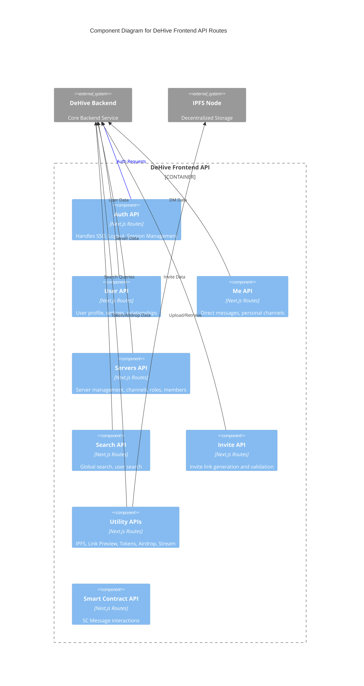

# API Route C4 Component Diagram

This diagram groups the API routes into functional components to provide a high-level view of the backend surface area.

```mermaid
C4Component
    title Component Diagram for DeHive Frontend API Routes

    Container_Boundary(api, "DeHive Frontend API") {

        Component(auth_api, "Auth API", "Next.js Routes", "Handles SSO, Logout, Session Management")
        Component(user_api, "User API", "Next.js Routes", "User profile, settings, relationships")
        Component(me_api, "Me API", "Next.js Routes", "Direct messages, personal channels")
        Component(servers_api, "Servers API", "Next.js Routes", "Server management, channels, roles, members")

        Component(search_api, "Search API", "Next.js Routes", "Global search, user search")
        Component(invite_api, "Invite API", "Next.js Routes", "Invite link generation and validation")

        Component(utils_api, "Utility APIs", "Next.js Routes", "IPFS, Link Preview, Tokens, Airdrop, Stream")
        Component(sc_api, "Smart Contract API", "Next.js Routes", "SC Message interactions")
    }

    System_Ext(backend, "DeHive Backend", "Core Backend Service")
    System_Ext(ipfs, "IPFS Node", "Decentralized Storage")

    Rel(auth_api, backend, "Auth Requests")
    Rel(user_api, backend, "User Data")
    Rel(me_api, backend, "DM Data")
    Rel(servers_api, backend, "Server Data")
    Rel(search_api, backend, "Search Queries")
    Rel(invite_api, backend, "Invite Data")

    Rel(utils_api, ipfs, "Upload/Retrieve")
    Rel(utils_api, backend, "Token/Airdrop Data")

    UpdateRelStyle(auth_api, backend, $textColor="blue", $lineColor="blue")
```
