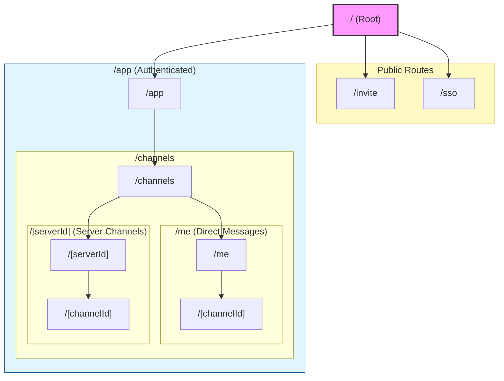

# App Routing / Sitemap Diagram

This diagram visualizes the application's route structure based on the Next.js App Router.

```mermaid
graph TD
    Root["/ (Root)"]

    subgraph Public["Public Routes"]
        Invite["/invite"]
        SSO["/sso"]
    end

    subgraph App["/app (Authenticated)"]
        AppRoot["/app"]

        subgraph Channels["/channels"]
            ChannelsRoot["/channels"]

            subgraph Me["/me (Direct Messages)"]
                MeRoot["/me"]
                MeChannel["/[channelId]"]
            end

            subgraph Server["/[serverId] (Server Channels)"]
                ServerRoot["/[serverId]"]
                ServerChannel["/[channelId]"]
            end
        end
    end

    Root --> Invite
    Root --> SSO
    Root --> AppRoot

    AppRoot --> ChannelsRoot
    ChannelsRoot --> MeRoot
    ChannelsRoot --> ServerRoot

    MeRoot --> MeChannel
    ServerRoot --> ServerChannel

    style Root fill:#f9f,stroke:#333,stroke-width:2px
    style App fill:#e1f5fe,stroke:#01579b
    style Public fill:#fff9c4,stroke:#fbc02d
```
