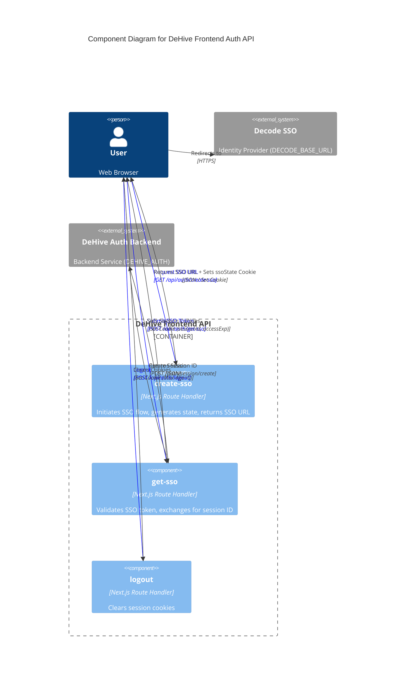

# C4 Component Diagram: Auth API

This diagram illustrates the components within `src/app/api/auth` and their interactions with external systems and the user.

```mermaid
C4Component
    title Component Diagram for DeHive Frontend Auth API

    Person(user, "User", "Web Browser")

    Container_Boundary(api, "DeHive Frontend API") {
        Component(create_sso, "create-sso", "Next.js Route Handler", "Initiates SSO flow, generates state, returns SSO URL")
        Component(get_sso, "get-sso", "Next.js Route Handler", "Validates SSO token, exchanges for session ID")
        Component(logout, "logout", "Next.js Route Handler", "Clears session cookies")
    }

    System_Ext(decode_sso, "Decode SSO", "Identity Provider (DECODE_BASE_URL)")
    System_Ext(dehive_auth, "DeHive Auth Backend", "Backend Service (DEHIVE_AUTH)")

    Rel(user, create_sso, "Request SSO URL", "GET /api/auth/create-sso")
    Rel(create_sso, user, "Returns SSO URL + Sets ssoState Cookie", "JSON / Set-Cookie")

    Rel(user, decode_sso, "Redirects to", "HTTPS")

    Rel(user, get_sso, "Submit SSO Token", "POST /api/auth/get-sso")
    Rel(get_sso, dehive_auth, "Create Session", "POST /auth/session/create")
    Rel(dehive_auth, get_sso, "Returns Session ID", "JSON")
    Rel(get_sso, user, "Sets Session Cookies", "Set-Cookie (sessionId, accessExp)")

    Rel(user, logout, "Logout", "POST /api/auth/logout")
    Rel(logout, user, "Clears Cookies", "Set-Cookie (Max-Age=0)")

    UpdateRelStyle(user, create_sso, $textColor="blue", $lineColor="blue")
    UpdateRelStyle(user, get_sso, $textColor="blue", $lineColor="blue")
    UpdateRelStyle(user, logout, $textColor="blue", $lineColor="blue")
```
