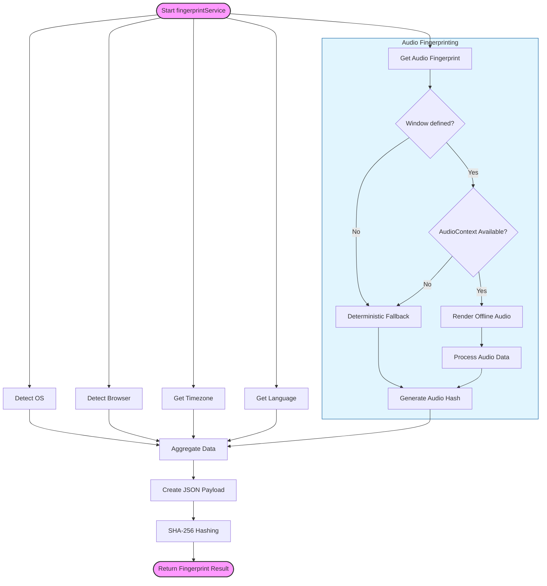

# Fingerprint Service Flowchart

This flowchart illustrates how the unique device fingerprint is generated.

```mermaid
flowchart TD
    Start([Start fingerprintService]) --> DetectOS[Detect OS]
    Start --> DetectBrowser[Detect Browser]
    Start --> GetTimezone[Get Timezone]
    Start --> GetLanguage[Get Language]
    Start --> GetAudio[Get Audio Fingerprint]

    subgraph AudioFingerprinting [Audio Fingerprinting]
        GetAudio --> CheckWindow{Window defined?}
        CheckWindow -- No --> Fallback[Deterministic Fallback]
        CheckWindow -- Yes --> CheckAudioContext{AudioContext Available?}
        CheckAudioContext -- No --> Fallback
        CheckAudioContext -- Yes --> RenderAudio[Render Offline Audio]
        RenderAudio --> ProcessAudio[Process Audio Data]
        ProcessAudio --> AudioHash[Generate Audio Hash]
        Fallback --> AudioHash
    end

    DetectOS --> Aggregate[Aggregate Data]
    DetectBrowser --> Aggregate
    GetTimezone --> Aggregate
    GetLanguage --> Aggregate
    AudioHash --> Aggregate

    Aggregate --> Payload[Create JSON Payload]
    Payload --> SHA256[SHA-256 Hashing]
    SHA256 --> Result([Return Fingerprint Result])

    style Start fill:#f9f,stroke:#333,stroke-width:2px
    style Result fill:#f9f,stroke:#333,stroke-width:2px
    style AudioFingerprinting fill:#e1f5fe,stroke:#01579b
```
