# Dehive Frontend Architecture Overview

## Complete System Architecture Diagram

```mermaid
flowchart TB
    subgraph AUTH["🔐 Authentication & Onboarding"]
        LOGIN["/  Login Page<br/>(SSO initiation)"]
        SSO["/sso  SSO Callback<br/>(token exchange)"]
        INVITE["/invite  Server Invite<br/>(join via code)"]
    end

    subgraph ROOT["🌐 Root Infrastructure"]
        ROOT_LAYOUT["Root Layout<br/>(fonts, metadata, PWA)"]
        REDUX["Redux Provider<br/>(global state wrapper)"]
    end

    subgraph APP["📱 Main Application Shell (/app)"]
        APP_LAYOUT["App Layout<br/>(auth guard, fingerprint, user fetch)"]
        APP_REDIRECT["/app  → /app/channels/me"]

        subgraph PROVIDERS["🔌 Provider Stack"]
            WEB3["Web3 Providers<br/>(Wagmi + RainbowKit)"]
            SOCKET_STATUS["Socket: User Status<br/>(online/offline)"]
            SOCKET_SERVER["Socket: Server Events<br/>(server CRUD, members)"]
            SOUND_CTX["Sound Context<br/>(notification sounds)"]
            DIRECT_CALL["DirectCall Provider<br/>(call state management)"]
        end

        subgraph SHELL["🎨 Persistent UI Shell"]
            GUILD_BAR["GuildBar<br/>(left: DM + server list)"]
            USER_BAR["UserBar<br/>(bottom-left: profile + controls)"]
        end
    end

    subgraph SERVER_ROUTES["🏰 Server Channels (/app/channels/[serverId])"]
        SERVER_LAYOUT["Server Layout<br/>(fetch categories, channels, members)"]
        SERVER_BAR["ServerBar<br/>(categories & channels tree)"]

        SERVER_HOME["/[serverId]<br/>Server Member List"]
        CHANNEL_PAGE["/[serverId]/[channelId]<br/>Channel Messages<br/>(text chat, files, search)"]
        CHANNEL_CALL["/[serverId]/[channelId]/call<br/>Voice/Video Channel Call"]

        subgraph SERVER_PROVIDERS["Server Socket Providers"]
            SOCKET_CHANNEL_CHAT["Socket: Channel Chat<br/>(messages, edits, deletes)"]
            SOCKET_CHANNEL_CALL["Socket: Channel Call<br/>(voice/video participants)"]
        end
    end

    subgraph DM_ROUTES["💬 Direct Messages (/app/channels/me)"]
        DM_LAYOUT["DM Layout<br/>(fetch conversations, status)"]
        DIRECT_BAR["DirectBar<br/>(conversation list)"]

        DM_HOME["/me<br/>Friends List<br/>(following users)"]
        DM_CHAT["/me/[channelId]<br/>DM Messages<br/>(text chat, files, search)"]
        DM_CALL["/me/[channelId]/call<br/>1-on-1 Voice/Video Call"]
        DM_PRIVATE["/me/[channelId]/[wallet]<br/>🔐 Blockchain Private Chat<br/>(encrypted on-chain messages)"]

        subgraph DM_PROVIDERS["DM Socket Providers"]
            SOCKET_DIRECT_CHAT["Socket: Direct Chat<br/>(messages, edits, deletes)"]
            CONV_CTX["Conversation Refresh Context<br/>(trigger conversation reload)"]
        end
    end

    subgraph SHARED["🔧 Shared Cross-Cutting Layers"]
        subgraph STORE["📦 Redux Store (6 slices)"]
            USER_SLICE["user<br/>(profile, bio, avatar)"]
            SERVER_LIST["serverList<br/>(joined servers)"]
            SERVER_ROOT["serverRoot<br/>(categories, channels, participants)"]
            FINGERPRINT["fingerprint<br/>(device ID)"]
            DIRECT_MEM["directMembers<br/>(DM conversations)"]
            SERVER_MEM["serverMembers<br/>(server member status)"]
        end

        subgraph HOOKS["🪝 Custom Hooks (13 hooks)"]
            USE_USER["useUser"]
            USE_SERVER_ROOT["useServerRoot"]
            USE_SERVER_LIST["useServersList"]
            USE_CHANNEL_MSG["useChannelMessage"]
            USE_DIRECT_MSG["useDirectMessage"]
            USE_FINGERPRINT["useFingerprint"]
            USE_CHANNEL_CALL["useChannelCall"]
            USE_DIRECT_CALL["useDirectCall"]
            USE_SERVER_MEM["useServerMember"]
            USE_DIRECT_MEM["useDirectMember"]
            USE_TOKEN["useTokenInfo"]
            USE_TRANSFER["useTransferMoney"]
            USE_INVITE["useInviteSuggestions"]
        end

        subgraph SOCKETS["🔌 Socket Singletons (6 connections)"]
            SOCK_STATUS["Status Socket<br/>(user online/offline)"]
            SOCK_SERVER["Server Events Socket<br/>(server/channel CRUD)"]
            SOCK_CH_CHAT["Channel Chat Socket<br/ver messages)"]
            SOCK_CH_CALL["Channel Call Socket<br/>(voice/video in channels)"]
            SOCK_DM_CHAT["Direct Chat Socket<br/>(DM messages)"]
            SOCK_DM_CALL["Direct Call Socket<br/>(1-on-1 calls)"]
        end

        subgraph BLOCKCHAIN["⛓️ Blockchain Layer"]
            WAGMI["Wagmi + Viem<br/>(wallet connection)"]
            SMART_CONTRACT["Smart Contract<br/>(on-chain encrypted messages)"]
            AIRDROP["Airdrop System<br/>(token distribution)"]
            PAYMENT["Payment Hub<br/>(crypto transfers)"]
        end

        subgraph FEATURES["✨ Feature Modules"]
            AIRDROP_COMP["Airdrop Components<br/>(create, list, claim)"]
            SEARCH["Search System<br/>(message history)"]
            FILE_MGMT["File Management<br/>(upload, preview, list)"]
            USER_PROFILE["User Profiles<br/>(view, follow, block)"]
            SERVER_MGMT["Server Management<br/>(settings, bans, invites, NFT gating)"]
        end
    end

    %% Navigation Flow
    LOGIN --> SSO
    SSO --> APP_REDIRECT
    INVITE --> SERVER_HOME

    ROOT_LAYOUT --> REDUX
    REDUX --> AUTH
    REDUX --> APP

    APP_LAYOUT --> PROVIDERS
    PROVIDERS --> SHELL
    APP_LAYOUT --> APP_REDIRECT
    APP_REDIRECT -.-> DM_HOME

    %% Server Route Flow
    APP_LAYOUT --> SERVER_LAYOUT
    SERVER_LAYOUT --> SERVER_PROVIDERS
    SERVER_LAYOUT --> SERVER_BAR
    SERVER_LAYOUT --> SERVER_HOME
    SERVER_LAYOUT --> CHANNEL_PAGE
    SERVER_LAYOUT --> CHANNEL_CALL

    %% DM Route Flow
    APP_LAYOUT --> DM_LAYOUT
    DM_LAYOUT --> DM_PROVIDERS
    DM_LAYOUT --> DIRECT_BAR
    DM_LAYOUT --> DM_HOME
    DM_LAYOUT --> DM_CHAT
    DM_LAYOUT --> DM_CALL
    DM_LAYOUT --> DM_PRIVATE

    %% Dependencies on Shared Layers
    SERVER_HOME -.->|uses| HOOKS
    CHANNEL_PAGE -.->|uses| HOOKS
    DM_CHAT -.->|uses| HOOKS
    DM_PRIVATE -.->|uses| BLOCKCHAIN

    SERVER_LAYOUT -.->|reads/writes| STORE
    DM_LAYOUT -.->|reads/writes| STORE
    GUILD_BAR -.->|reads| STORE
    SERVER_BAR -.->|reads| STORE
    DIRECT_BAR -.->|reads| STORE

    SOCKET_CHANNEL_CHAT -.->|connects to| SOCK_CH_CHAT
    SOCKET_CHANNEL_CALL -.->|connects to| SOCK_CH_CALL
    SOCKET_DIRECT_CHAT -.->|connects to| SOCK_DM_CHAT
    SOCKET_STATUS -.->|connects to| SOCK_STATUS
    SOCKET_SERVER -.->|connects to| SOCK_SERVER
    DIRECT_CALL -.->|connects to| SOCK_DM_CALL

    CHANNEL_PAGE -.->|uses| FEATURES
    DM_CHAT -.->|uses| FEATURES
    SERVER_BAR -.->|uses| SERVER_MGMT

    classDef authStyle fill:#4a5568,stroke:#2d3748,color:#fff
    classDef appStyle fill:#2563eb,stroke:#1e40af,color:#fff
    classDef serverStyle fill:#059669,stroke:#047857,color:#fff
    classDef dmStyle fill:#7c3aed,stroke:#6d28d9,color:#fff
    classDef sharedStyle fill:#dc2626,stroke:#b91c1c,color:#fff
    classDef shellStyle fill:#ea580c,stroke:#c2410c,color:#fff
    classDef blockchainStyle fill:#f59e0b,stroke:#d97706,color:#fff

    class LOGIN,SSO,INVITE authStyle
    class APP_LAYOUT,PROVIDERS,SHELL,APP_REDIRECT appStyle
    class SERVER_LAYOUT,SERVER_BAR,SERVER_HOME,CHANNEL_PAGE,CHANNEL_CALL,SERVER_PROVIDERS serverStyle
    class DM_LAYOUT,DIRECT_BAR,DM_HOME,DM_CHAT,DM_CALL,DM_PRIVATE,DM_PROVIDERS dmStyle
    class STORE,HOOKS,SOCKETS,FEATURES sharedStyle
    class GUILD_BAR,USER_BAR,SERVER_BAR,DIRECT_BAR shellStyle
    class BLOCKCHAIN,WAGMI,SMART_CONTRACT,AIRDROP,PAYMENT blockchainStyle
```



## Architecture Layers Breakdown

### 1. **Root Layer**
- **Root Layout** (`src/app/layout.tsx`): Global HTML wrapper with fonts, metadata, PWA manifest
- **Redux Provider** (`src/store/ReduxProvider.tsx`): Wraps entire app with Redux store

### 2. **Authentication Flow**
- **Login Page** (`src/app/page.tsx`): SSO initiation
- **SSO Callback** (`src/app/sso/page.tsx`): Token exchange and authentication
- **Invite Handler** (`src/app/invite/page.tsx`): Server invitation processing

### 3. **App Shell** (`/app`)
- **App Layout** (`src/app/app/layout.tsx`):
  - Fetches user profile and server list
  - Generates device fingerprint
  - Mounts all global providers
  - Renders persistent UI shell (GuildBar + UserBar)

- **Provider Stack**:
  - `Web3Providers`: Wagmi + RainbowKit for wallet connection
  - `SocketStatusProvider`: User online/offline status
  - `SocketServerEventsProvider`: Server-level real-time events
  - `SoundContext`: Notification sound preferences
  - `DirectCallProvider`: Direct call state management

- **Persistent UI Shell**:
  - `GuildBar` (left sidebar): Server list + DM button
  - `UserBar` (bottom-left): User profile, mic/sound controls, settings

### 4. **Server Channels** (`/app/channels/[serverId]`)
- **Server Layout** (`src/app/app/channels/[serverId]/layout.tsx`):
  - Fetches server categories, channels, and members
  - Mounts server-specific socket providers
  - Renders ServerBar (channel list)

- **Routes**:
  - `/[serverId]`: Server member list
  - `/[serverId]/[channelId]`: Channel messages (text chat, file uploads, search, airdrops)
  - `/[serverId]/[channelId]/call`: Voice/video channel call

- **Socket Providers**:
  - `ChannelChatProvider`: Real-time channel messages
  - `ChannelCallProvider`: Voice/video call participants

### 5. **Direct Messages** (`/app/channels/me`)
- **DM Layout** (`src/app/app/channels/me/layout.tsx`):
  - Fetches conversation list with user status
  - Mounts DM-specific socket providers
  - Renders DirectBar (conversation list)

- **Routes**:
  - `/me`: Friends list (following users)
  - `/me/[channelId]`: DM messages (text chat, file uploads, search)
  - `/me/[channelId]/call`: 1-on-1 voice/video call
  - `/me/[channelId]/[wallet]`: **Blockchain private chat** (encrypted on-chain messages)

- **Socket Providers**:
  - `DirectChatProvider`: Real-time DM messages
  - `ConversationRefreshContext`: Trigger conversation list reload

### 6. **Redux Store** (6 slices)
- `user`: User profile, bio, avatar, role
- `serverList`: List of joined servers
- `serverRoot`: Server categories, channels, and voice call participants
- `fingerprint`: Device fingerprint hash
- `directMembers`: DM conversation list with status
- `serverMembers`: Server member list with online status

### 7. **Custom Hooks** (13 hooks)
Business logic abstraction layer:
- `useUser`, `useFingerprint`: User state management
- `useServerRoot`, `useServersList`, `useServerMember`: Server state
- `useDirectMember`: DM conversation state
- `useChannelMessage`, `useDirectMessage`: Message CRUD operations
- `useChannelCall`, `useDirectCall`: Voice/video call operations
- `useTokenInfo`, `useTransferMoney`: Crypto payment operations
- `useInviteSuggestions`: Server invite suggestions

### 8. **Socket Singletons** (6 connections)
Real-time communication layer using Socket.IO:
- **Status Socket**: User online/offline status updates
- **Server Events Socket**: Server/channel CRUD, member join/leave
- **Channel Chat Socket**: Server channel messages (send, edit, delete)
- **Channel Call Socket**: Voice/video call in server channels
- **Direct Chat Socket**: DM messages (send, edit, delete)
- **Direct Call Socket**: 1-on-1 voice/video calls

### 9. **Blockchain Layer**
- **Wagmi + Viem**: Wallet connection and smart contract interaction
- **Smart Contract Messages** (`src/lib/scMessage.ts`):
  - On-chain encrypted messaging
  - Conversation key management
  - Pay-as-you-go or relayer-based sending
- **Airdrop System**: Token distribution campaigns
- **Payment Hub**: Crypto transfers between users

### 10. **Feature Modules**
- **Airdrop Components**: Create campaigns, list airdrops, claim tokens
- **Search System**: Message history search with pagination
- **File Management**: Upload, preview (images/videos/files), file list
- **User Profiles**: View profiles, follow/unfollow, block users
- **Server Management**: Server settings, bans, invites, NFT gating

## Key Technical Decisions

### Discord-like UI Architecture
- **3-column layout**: GuildBar (servers) | ServerBar/DirectBar (channels/DMs) | Main Content
- **Persistent shell**: GuildBar and UserBar always visible across routes
- **Conditional sidebars**: ServerBar for servers, DirectBar for DMs

### Real-time Communication
- **6 separate Socket.IO connections** for different concerns
- **Singleton pattern** for socket instances to prevent duplicate connections
- **Provider pattern** for socket lifecycle management

### State Management
- **Redux Toolkit** for global state (user, servers, members)
- **React Context** for feature-specific state (sound, calls, conversation refresh)
- **Custom hooks** for business logic abstraction

### Blockchain Integration
- **Wagmi + RainbowKit** for wallet connection
- **Viem** for smart contract interactions
- **Encrypted on-chain messaging** with conversation key management
- **Dual payment modes**: Pay-as-you-go (direct) or relayer-based (prepaid)

### Performance Optimizations
- **Pagination** for message history (20 messages per page)
- **Infinite scroll** with scroll position restoration
- **Socket event deduplication** to prevent duplicate messages
- **Lazy loading** for heavy components (Popover, dynamic imports)

### Security Features
- **Device fingerprinting** for session management
- **SSO authentication** via Decode network
- **End-to-end encryption** for blockchain messages
- **NFT gating** for exclusive server access

## File Structure Summary

```
src/
├── app/                          # Next.js App Router
│   ├── api/                      # Backend API routes
│   ├── app/                      # Main application
│   │   └── channels/             # Channel routes
│   │       ├── [serverId]/       # Server channels
│   │       └── me/               # Direct messages
│   ├── invite/                   # Invite handler
│   ├── sso/                      # SSO callback
│   └── page.tsx                  # Login page
├── components/                   # React components
│   ├── app/                      # Shell components (GuildBar, ServerBar, etc.)
│   ├── airdrop/                  # Airdrop features
│   ├── common/                   # Shared components
│   ├── messages/                 # Message-related components
│   ├── search/                   # Search components
│   ├── server-bar/               # Server management
│   ├── ui/                       # UI primitives (shadcn/ui)
│   └── user-bar/                 # User settings
├── hooks/                        # Custom React hooks (13 hooks)
├── store/                        # Redux store
│   └── slices/                   # Redux slices (6 slices)
├── providers/                    # Socket providers (6 providers)
├── lib/                          # Socket singletons + utilities
├── contexts/                     # React contexts (3 contexts)
├── interfaces/                   # TypeScript interfaces
├── services/                     # Business logic services
├── utils/                        # Utility functions
├── abi/                          # Smart contract ABIs
└── constants/                    # App constants
```

## Data Flow Examples

### Sending a Channel Message
1. User types message in `ChannelMessagePage`
2. Calls `send()` from `useChannelMessage` hook
3. Hook emits `sendMessage` event via `ChannelChatSocket`
4. Backend processes and broadcasts to all channel members
5. Socket receives `newMessage` event
6. Hook updates local `messages` state
7. Component re-renders with new message

### Joining a Server via Invite
1. User clicks invite link → `/invite?code=ABC123`
2. `InvitePage` calls `/api/invite` with code
3. Backend validates and adds user to server
4. Redirects to `/app/channels/[serverId]`
5. `ServerLayout` fetches categories and channels
6. `SocketServerEventsProvider` joins server room
7. Real-time updates for server events begin

### Blockchain Private Messaging
1. User enables "Private Mode" in DM
2. Navigates to `/me/[channelId]/[wallet]`
3. `SmartContractMessagePage` computes conversation ID
4. Checks if conversation exists on-chain
5. If not, creates conversation with encrypted keys
6. Encrypts message with conversation key
7. Sends transaction to smart contract
8. Watches for `MessageSent` event
9. Decrypts and displays message

---

**Last Updated**: 2024
**Architecture Version**: 1.0
**Framework**: Next.js 14 (App Router)
**State Management**: Redux Toolkit
**Real-time**: Socket.IO
**Blockchain**: Wagmi + Viem (Sepolia testnet)
