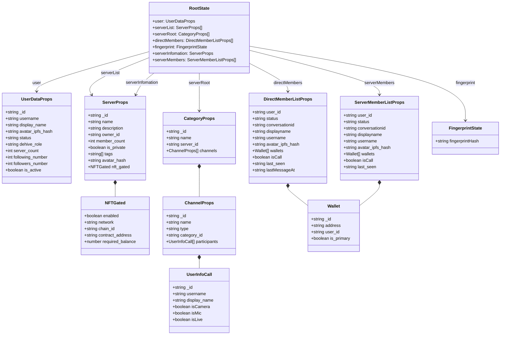

# Redux State Class Diagram

This diagram illustrates the structure of the Redux global state and the relationships between different state slices.

```mermaid
classDiagram
    class RootState {
        +user: UserDataProps
        +serverList: ServerProps[]
        +serverRoot: CategoryProps[]
        +directMembers: DirectMemberListProps[]
        +fingerprint: FingerprintState
        +serverInfomation: ServerProps
        +serverMembers: ServerMemberListProps[]
    }

    class UserDataProps {
        +string _id
        +string username
        +string display_name
        +string avatar_ipfs_hash
        +string status
        +string dehive_role
        +int server_count
        +int following_number
        +int followers_number
        +boolean is_active
    }

    class ServerProps {
        +string _id
        +string name
        +string description
        +string owner_id
        +int member_count
        +boolean is_private
        +string[] tags
        +string avatar_hash
        +NFTGated nft_gated
    }

    class NFTGated {
        +boolean enabled
        +string network
        +string chain_id
        +string contract_address
        +number required_balance
    }

    class CategoryProps {
        +string _id
        +string name
        +string server_id
        +ChannelProps[] channels
    }

    class ChannelProps {
        +string _id
        +string name
        +string type
        +string category_id
        +UserInfoCall[] participants
    }

    class UserInfoCall {
        +string _id
        +string username
        +string display_name
        +boolean isCamera
        +boolean isMic
        +boolean isLive
    }

    class DirectMemberListProps {
        +string user_id
        +string status
        +string conversationid
        +string displayname
        +string username
        +string avatar_ipfs_hash
        +Wallet[] wallets
        +boolean isCall
        +string last_seen
        +string lastMessageAt
    }

    class ServerMemberListProps {
        +string user_id
        +string status
        +string conversationid
        +string displayname
        +string username
        +string avatar_ipfs_hash
        +Wallet[] wallets
        +boolean isCall
        +string last_seen
    }

    class Wallet {
        +string _id
        +string address
        +string user_id
        +boolean is_primary
    }

    class FingerprintState {
        +string fingerprintHash
    }

    RootState --> UserDataProps : user
    RootState --> ServerProps : serverList
    RootState --> CategoryProps : serverRoot
    RootState --> DirectMemberListProps : directMembers
    RootState --> FingerprintState : fingerprint
    RootState --> ServerProps : serverInfomation
    RootState --> ServerMemberListProps : serverMembers

    ServerProps *-- NFTGated
    CategoryProps *-- ChannelProps
    ChannelProps *-- UserInfoCall
    DirectMemberListProps *-- Wallet
    ServerMemberListProps *-- Wallet
```
