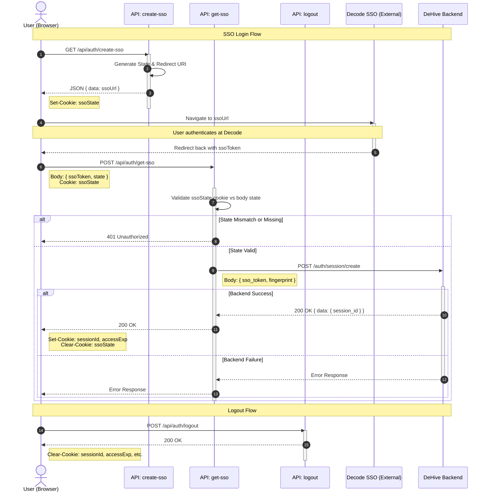

# Sequence Diagram: Auth Flow

This diagram details the interaction flow for SSO Login and Logout.

```mermaid
sequenceDiagram
    autonumber
    actor User as User (Browser)
    participant FE_Create as API: create-sso
    participant FE_Get as API: get-sso
    participant FE_Logout as API: logout
    participant DecodeSSO as Decode SSO (External)
    participant Backend as DeHive Backend

    Note over User, Backend: SSO Login Flow

    User->>FE_Create: GET /api/auth/create-sso
    activate FE_Create
    FE_Create->>FE_Create: Generate State & Redirect URI
    FE_Create-->>User: JSON { data: ssoUrl }
    Note right of User: Set-Cookie: ssoState
    deactivate FE_Create

    User->>DecodeSSO: Navigate to ssoUrl
    activate DecodeSSO
    Note over User, DecodeSSO: User authenticates at Decode
    DecodeSSO-->>User: Redirect back with ssoToken
    deactivate DecodeSSO

    User->>FE_Get: POST /api/auth/get-sso
    Note right of User: Body: { ssoToken, state }<br/>Cookie: ssoState
    activate FE_Get

    FE_Get->>FE_Get: Validate ssoState cookie vs body state
    alt State Mismatch or Missing
        FE_Get-->>User: 401 Unauthorized
    else State Valid
        FE_Get->>Backend: POST /auth/session/create
        Note right of FE_Get: Body: { sso_token, fingerprint }
        activate Backend

        alt Backend Success
            Backend-->>FE_Get: 200 OK { data: { session_id } }
            FE_Get-->>User: 200 OK
            Note right of User: Set-Cookie: sessionId, accessExp<br/>Clear-Cookie: ssoState
        else Backend Failure
            Backend-->>FE_Get: Error Response
            deactivate Backend
            FE_Get-->>User: Error Response
        end
    end
    deactivate FE_Get

    Note over User, Backend: Logout Flow

    User->>FE_Logout: POST /api/auth/logout
    activate FE_Logout
    FE_Logout-->>User: 200 OK
    Note right of User: Clear-Cookie: sessionId, accessExp, etc.
    deactivate FE_Logout
```
