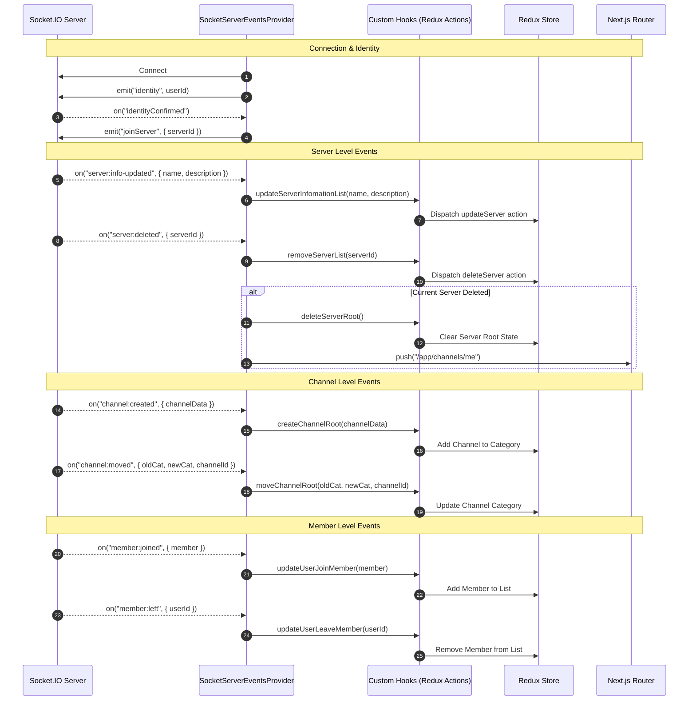

# Socket Event Sequence Diagram

This diagram illustrates how real-time events from the server are handled by the client, triggering Redux state updates.

```mermaid
sequenceDiagram
    autonumber
    participant Server as Socket.IO Server
    participant Provider as SocketServerEventsProvider
    participant Hooks as Custom Hooks (Redux Actions)
    participant Store as Redux Store
    participant Router as Next.js Router

    Note over Server, Router: Connection & Identity

    Provider->>Server: Connect
    Provider->>Server: emit("identity", userId)
    Server-->>Provider: on("identityConfirmed")
    Provider->>Server: emit("joinServer", { serverId })

    Note over Server, Router: Server Level Events

    Server-->>Provider: on("server:info-updated", { name, description })
    Provider->>Hooks: updateServerInfomationList(name, description)
    Hooks->>Store: Dispatch updateServer action

    Server-->>Provider: on("server:deleted", { serverId })
    Provider->>Hooks: removeServerList(serverId)
    Hooks->>Store: Dispatch deleteServer action
    alt Current Server Deleted
        Provider->>Hooks: deleteServerRoot()
        Hooks->>Store: Clear Server Root State
        Provider->>Router: push("/app/channels/me")
    end

    Note over Server, Router: Channel Level Events

    Server-->>Provider: on("channel:created", { channelData })
    Provider->>Hooks: createChannelRoot(channelData)
    Hooks->>Store: Add Channel to Category

    Server-->>Provider: on("channel:moved", { oldCat, newCat, channelId })
    Provider->>Hooks: moveChannelRoot(oldCat, newCat, channelId)
    Hooks->>Store: Update Channel Category

    Note over Server, Router: Member Level Events

    Server-->>Provider: on("member:joined", { member })
    Provider->>Hooks: updateUserJoinMember(member)
    Hooks->>Store: Add Member to List

    Server-->>Provider: on("member:left", { userId })
    Provider->>Hooks: updateUserLeaveMember(userId)
    Hooks->>Store: Remove Member from List
```
