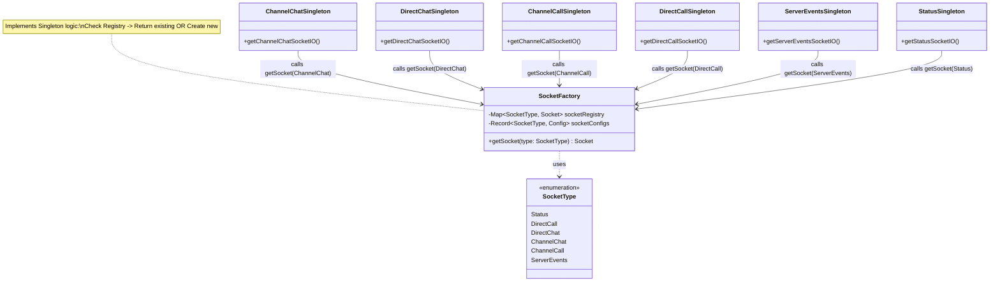

# Socket.io Factory and Singleton Architecture

This document illustrates how the **Factory** and **Singleton** design patterns are applied in your `src/lib` socket implementation.

## Overview

The architecture uses a central **Factory** (`socketFactory.ts`) to manage socket connections. It maintains a **Registry** (a `Map`) to ensure that only one socket connection exists for each `SocketType`. This effectively implements the **Singleton** pattern for each socket type, while the factory provides a centralized way to create and access them.

### Key Components

1.  **SocketFactory (`socketFactory.ts`)**:
    *   **Registry**: `socketRegistry` (Map) stores active socket instances.
    *   **Configuration**: `socketConfigs` maps types to URLs.
    *   **Factory Method**: `getSocket(type)` checks the registry. If an instance exists, it returns it (Singleton behavior). If not, it creates a new one, stores it, and returns it (Factory behavior).

2.  **Singletons (`socketio*Singleton.ts`)**:
    *   These are convenience wrappers (e.g., `getChannelChatSocketIO`).
    *   They call `getSocket` with a specific `SocketType`.
    *   They provide type safety by casting the generic `Socket` to specific typed interfaces (e.g., `ServerToClientChannelChat`).

## Diagram

## Flow Description

1.  **Request**: A component (e.g., a React component) calls a specific singleton function like `getChannelChatSocketIO()`.
2.  **Delegation**: `getChannelChatSocketIO()` calls `getSocket(SocketType.ChannelChat)` from the `SocketFactory`.
3.  **Check Registry**: `getSocket` checks `socketRegistry` to see if a socket for `ChannelChat` already exists.
4.  **Return/Create**:
    *   **If yes**: It returns the existing instance.
    *   **If no**: It looks up the URL in `socketConfigs`, creates a new `io` connection, saves it to the registry, and returns it.
5.  **Type Casting**: The singleton function casts the returned generic `Socket` to a typed socket (e.g., `Socket<ServerToClientChannelChat, ...>`) for type-safe usage in the application.
